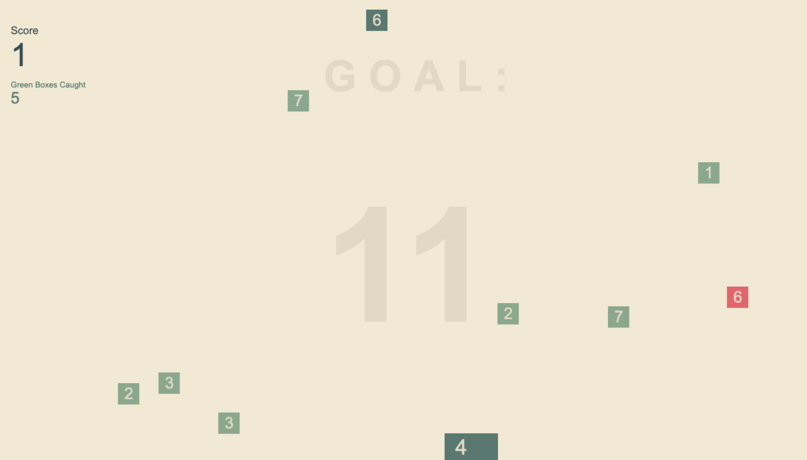
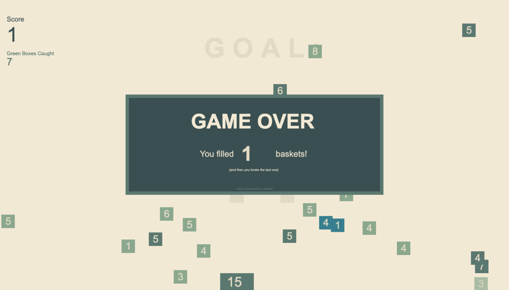

# falling-box-math
A game I made in high school when I first learned HTML, CSS, and JavaScript. The player must use their mouse to catch falling boxes, but only those that will add up to the goal. The game was designed to encourage elementary students (like the ones I tutored at that time) to practice their mental math skills in a fun and engaging way.

